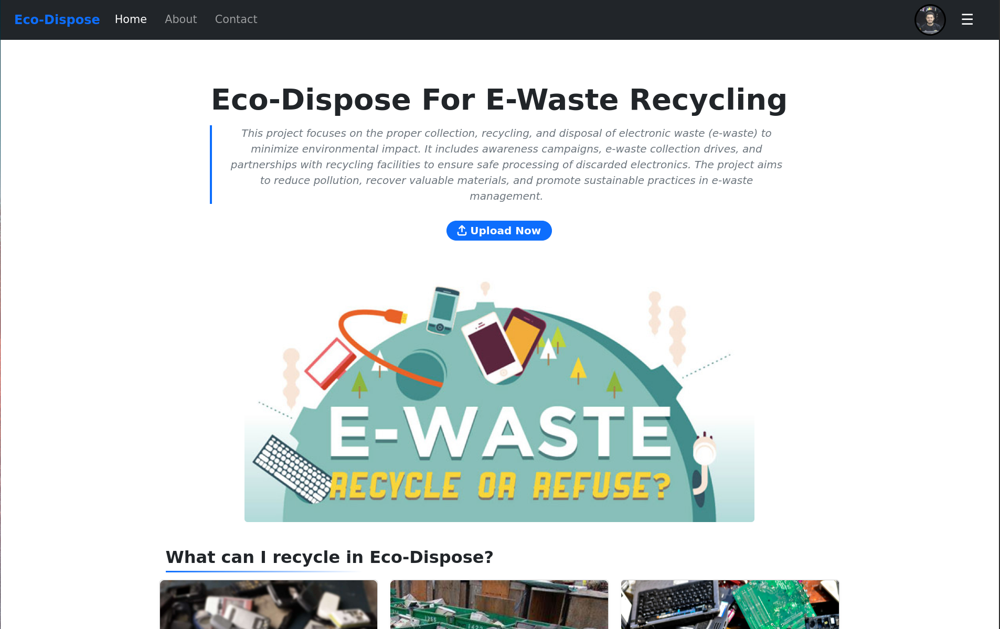

# [Eco-Dispose: E-Waste Management System](https://bahaamohamed98.github.io/Eco-Dispose/)

A full-stack application for electronic waste management and recycling, built with Vue.js and Flask.

## Overview

Eco-Dispose allows users to submit electronic devices for evaluation and recycling. Users can track their devices through the entire lifecycle from submission to final recycling.



## Key Features

- User authentication and profile management
- Electronic device submission with photos
- Real-time status tracking
- Admin dashboard for device evaluation
- Offer management-system

## Project Structure

```text
Eco-Dispose/
├── backend/ # Flask API server
├── frontend/ # Vue.js SPA
├── docs/ # Project documentation
└── README.md
```

## Quick Start

### Frontend Setup

```bash
cd frontend

# Install dependencies
npm install

# Build the project
npm run build

# Run the development server
npm run preview
```

### Backend Setup

```bash
cd backend

# Create a virtual environment
python -m venv .venv
source .venv/bin/activate  # On Windows: .venv\Scripts\activate

# Install the requirements
pip install -r requirements.txt

# run the server
flask run
```

## Documentation

- [API Documentation](docs/api/index.md)
- [Frontend Documentation](frontend/README.md)
- [Backend Documentation](backend/README.md)

## License

This project is licensed under the MIT License. See the [LICENSE](LICENSE) file for details.

