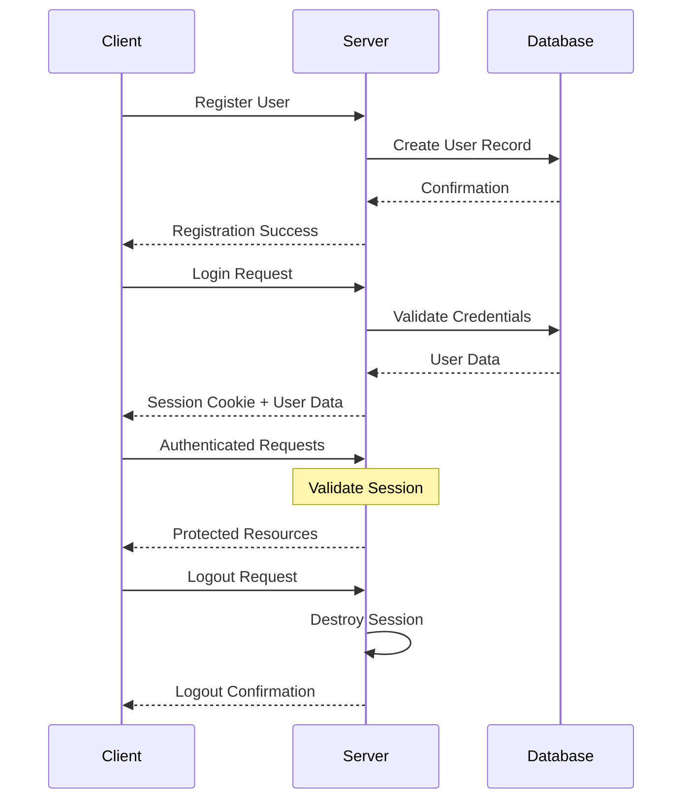

# 🔐 Authentication API Documentation

## 📌 Introduction

The Eco-Dispose authentication system manages user identity and access control throughout the application. This API
provides secure endpoints for user registration, authentication, profile management, and session handling, returning
JSON responses that integrate seamlessly with the Vue frontend.

## 🌐 API Overview

| Endpoint                        | Method | Description              | Authentication Required |
|---------------------------------|--------|--------------------------|-------------------------|
| [`/auth/register`](#register)   | POST   | Register a new user      | No                      |
| [`/auth/login`](#login)         | POST   | Authenticate a user      | No                      |
| [`/auth/profile`](#get-profile) | GET    | Get current user profile | Yes                     |
| [`/auth/edit`](#edit-profile)   | POST   | Update user profile      | Yes                     |
| [`/auth/logout`](#logout)       | POST   | End user session         | Yes                     |

---

### Authentication Flow

The following diagram illustrates the authentication process in the Eco-Dispose system:



---

## 🔌 API Endpoints

### Register

Create a new user account.

**Endpoint:** `/auth/register`  
**Method:** `POST`  
**Content-Type:** `form-data`

#### Request Parameters

| Field     | Type   | Required | Description                           |
|-----------|--------|----------|---------------------------------------|
| firstName | String | Yes      | User's first name                     |
| lastName  | String | Yes      | User's last name                      |
| email     | String | Yes      | User's email address (must be unique) |
| password  | String | Yes      | User's password                       |

#### Response

**Success (201 Created):**

```json
{
  "message": "registered successfully",
  "user": {
    "id": 1,
    "firstName": "John",
    "lastName": "Doe",
    "email": "john.doe@example.com",
    "profileImageUrl": null,
    "phoneNumber": null,
    "address": {
      "street": null,
      "city": null,
      "country": null,
      "zipCode": null
    }
  }
}
```

**Error Responses:**

**409 Conflict:**

```json
{
  "error": "email already in use"
}
```

**400 Bad Request:**

```json
{
  "message": "missing required fields"
}
```

For a comprehensive list of status codes, see [API Status Codes](index.md#status-codes).

#### Example

```javascript
// User Registration Example
async function registerUser() {
    const formData = new FormData();

    formData.append('firstName', 'John');
    formData.append('lastName', 'Doe');
    formData.append('email', 'john.doe@example.com');
    formData.append('password', 'securePassword123');

    try {
        const response = await fetch('/auth/register', {
            method: 'POST',
            body: formData
        });

        const data = await response.json();

        if (!response.ok) {
            throw new Error(data.error || data.message || 'Registration failed');
        }

        console.log('Registration successful:', data);
        return data;
    } catch (error) {
        console.error('Registration error:', error);
        throw error;
    }
}
```

---

### Login

Authenticate a user and start a session.

**Endpoint:** `/auth/login`  
**Method:** `POST`  
**Content-Type:** `form-data`

#### Request Parameters

| Field    | Type   | Required | Description          |
|----------|--------|----------|----------------------|
| email    | String | Yes      | User's email address |
| password | String | Yes      | User's password      |

#### Response

**Success (200 OK):**

```json
{
  "message": "logged in as John",
  "user": {
    "id": 1,
    "firstName": "John",
    "lastName": "Doe",
    "email": "john.doe@example.com",
    "profileImageUrl": null,
    "phoneNumber": null,
    "address": {
      "street": null,
      "city": null,
      "country": null,
      "zipCode": null
    }
  }
}
```

**Error Responses:**

**400 Bad Request:**

```json
{
  "error": "missing email or password"
}
```

**401 Unauthorized:**

```json
{
  "message": "wrong credentials"
}
```

**404 Not Found:**

```json
{
  "message": "user not found"
}
```

For a comprehensive list of status codes, see [API Status Codes](index.md#status-codes).

#### Example

```javascript
// User Login Example
async function loginUser(email, password) {
    const formData = new FormData();
    formData.append('email', email);
    formData.append('password', password);

    try {
        const response = await fetch('/auth/login', {
            method: 'POST',
            body: formData
        });

        const data = await response.json();

        if (!response.ok) {
            throw new Error(data.error || data.message || 'Login failed');
        }

        console.log('Login successful:', data);
        return data;
    } catch (error) {
        console.error('Login error:', error);
        throw error;
    }
}
```

---

### Get Profile

Retrieve the current user's profile information.

**Endpoint:** `/auth/profile`  
**Method:** `GET`  
**Authentication:** Required

#### Response

**Success (200 OK):**

```json
{
  "user": {
    "id": 1,
    "firstName": "John",
    "lastName": "Doe",
    "email": "john.doe@example.com",
    "profileImageUrl": "/static/uploads/profile1234.jpg",
    "phoneNumber": "+1234567890",
    "address": {
      "street": "123 Main St",
      "city": "New York",
      "country": "USA",
      "zipCode": "10001"
    }
  }
}
```

**Error Responses:**

**401 Unauthorized:**

```json
{
  "message": "not allowed"
}
```

For a comprehensive list of status codes, see [API Status Codes](index.md#status-codes).

#### Example

```javascript
// Get User Profile Example
async function getUserProfile() {
    try {
        const response = await fetch('/auth/profile', {
            method: 'GET',
            credentials: 'include' // Important for sending cookies in cross-origin requests
        });

        const data = await response.json();

        if (!response.ok) {
            throw new Error(data.error || data.message || 'Failed to load profile');
        }

        console.log('Profile retrieved successfully:', data);
        return data;
    } catch (error) {
        console.error('Profile retrieval error:', error);
        throw error;
    }
}
```

---

### Edit Profile

Update the current user's profile information.

**Endpoint:** `/auth/edit`  
**Method:** `POST`  
**Content-Type:** `multipart/form-data`  
**Authentication:** Required

#### Request Parameters

| Field        | Type        | Required | Description                |
|--------------|-------------|----------|----------------------------|
| profileImage | File        | No       | User's profile image       |
| user         | JSON String | No       | User's updated information |

The `user` JSON object can include:

```json
{
  "firstName": "Updated First Name",
  "lastName": "Updated Last Name",
  "phoneNumber": "Updated Phone Number",
  "address": {
    "street": "Updated Street",
    "city": "Updated City",
    "country": "Updated Country",
    "zipCode": "Updated Zip Code"
  }
}
```

#### Response

**Success (200 OK):**

```json
{
  "message": "user details updated successfully",
  "user": {
    "id": 1,
    "firstName": "Updated First Name",
    "lastName": "Updated Last Name",
    "email": "john.doe@example.com",
    "profileImageUrl": "/static/uploads/newprofile1234.jpg",
    "phoneNumber": "Updated Phone Number",
    "address": {
      "street": "Updated Street",
      "city": "Updated City",
      "country": "Updated Country",
      "zipCode": "Updated Zip Code"
    }
  }
}
```

**Error Responses:**

**400 Bad Request:**

```json
{
  "error": "no data provided"
}
```

**401 Unauthorized:**

```json
{
  "message": "not allowed"
}
```

**409 Conflict:**

```json
{
  "error": "invalid user state"
}
```

For a comprehensive list of status codes, see [API Status Codes](index.md#status-codes).

#### Example

```javascript
// Edit User Profile Example
async function updateUserProfile(userData, profileImageFile = null) {
    const formData = new FormData();

    // Add user JSON data
    if (userData) {
        formData.append('user', JSON.stringify(userData));
    }

    // Add profile image if provided
    if (profileImageFile) {
        formData.append('profileImage', profileImageFile);
    }

    try {
        const response = await fetch('/auth/edit', {
            method: 'POST',
            body: formData,
            credentials: 'include'
        });

        const data = await response.json();

        if (!response.ok) {
            throw new Error(data.error || data.message || 'Profile update failed');
        }

        console.log('Profile updated successfully:', data);
        return data;
    } catch (error) {
        console.error('Profile update error:', error);
        throw error;
    }
}
```

---

### Logout

End the current user's session.

**Endpoint:** `/auth/logout`  
**Method:** `POST`  
**Authentication:** Required

#### Response

**Success (200 OK):**

```json
{
  "message": "logged out successfully"
}
```

**Error Responses:**

**401 Unauthorized:**

```json
{
  "message": "not allowed"
}
```

For a comprehensive list of status codes, see [API Status Codes](index.md#status-codes).

#### Example

```javascript
// User Logout Example
async function logoutUser() {
    try {
        const response = await fetch('/auth/logout', {
            method: 'POST',
            credentials: 'include'
        });

        const data = await response.json();

        if (!response.ok) {
            throw new Error(data.error || data.message || 'Logout failed');
        }

        console.log('Logout successful:', data);
        return data;
    } catch (error) {
        console.error('Logout error:', error);
        throw error;
    }
}
```

---

## 🔒 Security Considerations

### Password Handling

- Passwords are never stored in plain text
- The `set_password()` method handles password hashing
- Password validation is performed using the `check_password()` method

### Session Management

- Sessions are managed by Flask-Login
- Authentication state is tracked using cookies
- The `@login_required` decorator protects endpoints that require authentication
- Sessions can be terminated with the logout endpoint

### Data Validation

- Input validation is performed on all endpoints
- Missing required fields trigger appropriate error responses
- Email uniqueness is enforced at the database level

### CSRF Protection

For production use, implement CSRF protection using:

```javascript
// Example of including CSRF token in requests
async function secureRequest(url, method, formData) {
    // Get CSRF token from meta tag
    const csrfToken = document.querySelector('meta[name="csrf-token"]').getAttribute('content');

    // Add to form data or headers as appropriate for your setup
    formData.append('csrf_token', csrfToken);

    const response = await fetch(url, {
        method: method,
        body: formData,
        credentials: 'include'
    });

    return response;
}
```

---