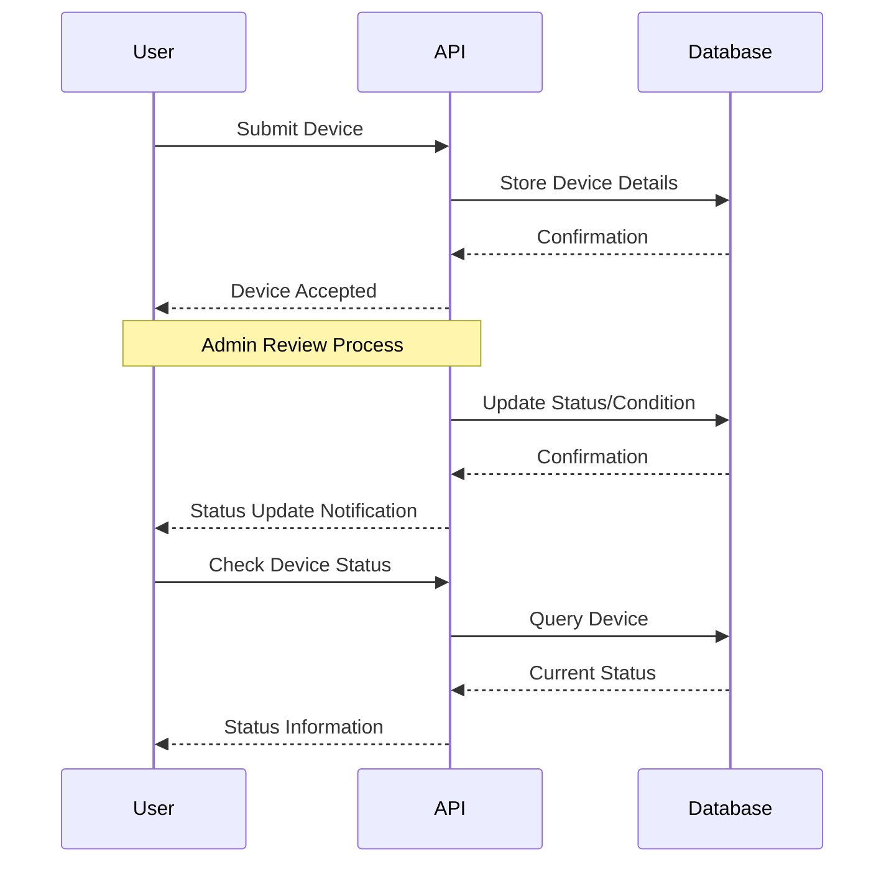

# 📱 Devices API Documentation

## 📌 Introduction

The Eco-Dispose Devices API enables users to manage electronic devices in the recycling system. This API provides
endpoints for submitting devices for recycling, checking device status, updating device information, and removing
devices from the system. The API implements role-based permissions, where regular users can manage their own submitted
devices while administrators have expanded capabilities.

## 🌐 API Overview

| Endpoint                          | Method | Description               | Authentication Required | User Type     |
| --------------------------------- | ------ | ------------------------- | ----------------------- | ------------- |
| [`/devices/`](#list-devices)      | GET    | List devices              | Yes                     | Any           |
| [`/devices/`](#add-device)        | POST   | Submit a new device       | Yes                     | Regular Users |
| [`/devices/<id>`](#update-device) | PUT    | Update device information | Yes                     | User/Admin    |
| [`/devices/<id>`](#delete-device) | DELETE | Remove a device           | Yes                     | Owner only    |

---

### Device Management Flow

The following diagram illustrates the device recycling workflow in the Eco-Dispose system:



---

## 🔌 API Endpoints

### List Devices

Retrieve all devices accessible to the current user.

**Endpoint:** `/devices/`  
**Method:** `GET`  
**Authentication:** Required

#### Response

**Success (200 OK):**

Regular users receive their own devices:

```json
[
  {
    "id": 1,
    "name": "iPhone 12",
    "userDescription": "Good condition, minor scratches on screen",
    "imageUrl": "/uploads/device1234.jpg",
    "uploadDate": "2025-04-10T14:30:00Z",
    "condition": "GOOD",
    "status": "PENDING_REVIEW",
    "estimatedPrice": 150.0,
    "adminNotes": null,
    "userId": 1
  },
  {
    "id": 2,
    "name": "Samsung Galaxy S21",
    "userDescription": "Perfect working condition, factory reset completed",
    "imageUrl": "/uploads/device5678.jpg",
    "uploadDate": "2025-04-12T09:15:00Z",
    "condition": "EXCELLENT",
    "status": "APPROVED",
    "estimatedPrice": 200.0,
    "adminNotes": "Device verified, ready for processing",
    "userId": 1
  }
]
```

Administrators receive all devices in the system:

```json
[
  {
    "id": 1,
    "name": "iPhone 12",
    "userDescription": "Good condition, minor scratches on screen",
    "imageUrl": "/uploads/device1234.jpg",
    "uploadDate": "2025-04-10T14:30:00Z",
    "condition": "GOOD",
    "status": "PENDING_REVIEW",
    "estimatedPrice": 150.0,
    "adminNotes": null,
    "userId": 1
  },
  {
    "id": 2,
    "name": "Samsung Galaxy S21",
    "userDescription": "Perfect working condition, factory reset completed",
    "imageUrl": "/uploads/device5678.jpg",
    "uploadDate": "2025-04-12T09:15:00Z",
    "condition": "EXCELLENT",
    "status": "APPROVED",
    "estimatedPrice": 200.0,
    "adminNotes": "Device verified, ready for processing",
    "userId": 1
  },
  {
    "id": 3,
    "name": "Dell XPS 13",
    "userDescription": "3 years old, battery needs replacement",
    "imageUrl": "/uploads/device9012.jpg",
    "uploadDate": "2025-04-11T11:45:00Z",
    "condition": "FAIR",
    "status": "PENDING_REVIEW",
    "estimatedPrice": null,
    "adminNotes": null,
    "userId": 2
  }
]
```

**Error Responses:**

**401 Unauthorized:**

```json
{
  "message": "not allowed"
}
```

**500 Server Error:**

```json
{
  "error": "An unexpected error occurred. Please try again later."
}
```

For a comprehensive list of status codes, see [API Status Codes](index.md#status-codes).

#### Example

```javascript
// Get Devices Example
async function getDevices() {
  try {
    const response = await fetch("/devices/", {
      method: "GET",
      credentials: "include", // Important for sending cookies in cross-origin requests
    });

    const data = await response.json();

    if (!response.ok) {
      throw new Error(data.error || data.message || "Failed to fetch devices");
    }

    console.log("Devices retrieved successfully:", data);
    return data;
  } catch (error) {
    console.error("Error retrieving devices:", error);
    throw error;
  }
}
```

---

### Add Device

Submit a new device for recycling.

**Endpoint:** `/devices/`  
**Method:** `POST`  
**Content-Type:** `multipart/form-data`  
**Authentication:** Required (Regular users only)

#### Request Parameters

| Field  | Type        | Required | Description                           |
| ------ | ----------- | -------- | ------------------------------------- |
| device | JSON String | Yes      | JSON string containing device details |
| image  | File        | Yes      | Image of the device                   |

The `device` JSON object must include:

```json
{
  "name": "Device Name",
  "type": "Device type",
  "defects": "Device defects",
  "userDescription": "Detailed description of the device condition"
}
```

#### Response

**Success (201 Created):**

```json
{
  "message": "Device added successfully",
  "device": {
    "id": 1,
    "name": "iPhone 12",
    "type": "Phone",
    "defects": "broken power button",
    "userDescription": "Good condition, minor scratches on screen",
    "imageUrl": "/uploads/device1234.jpg",
    "uploadDate": "2025-04-13T14:30:00Z",
    "condition": null,
    "status": "PENDING_REVIEW",
    "estimatedPrice": null,
    "adminNotes": null,
    "userId": 1
  }
}
```

**Error Responses:**

**400 Bad Request:**

```json
{
  "error": "Missing required fields: name, user_description, or image_url"
}
```

**400 Bad Request:**

```json
{
  "error": "Invalid image file"
}
```

**403 Forbidden:**

```json
{
  "error": "Admins cannot add devices"
}
```

**500 Server Error:**

```json
{
  "error": "An unexpected error occurred. Please try again later."
}
```

For a comprehensive list of status codes, see [API Status Codes](index.md#status-codes).

#### Example

```javascript
// Add Device Example
async function addDevice(deviceName, userDescription, imageFile) {
  try {
    const formData = new FormData();

    // Create device JSON object
    const deviceData = {
      name: deviceName,
      userDescription: userDescription,
    };

    // Append data to form
    formData.append("device", JSON.stringify(deviceData));
    formData.append("image", imageFile);

    const response = await fetch("/devices/", {
      method: "POST",
      body: formData,
      credentials: "include",
    });

    const data = await response.json();

    if (!response.ok) {
      throw new Error(data.error || data.message || "Failed to add device");
    }

    console.log("Device added successfully:", data);
    return data;
  } catch (error) {
    console.error("Error adding device:", error);
    throw error;
  }
}
```

---

### Update Device

Update information for an existing device.

**Endpoint:** `/devices/<id>`  
**Method:** `PUT`  
**Content-Type:** `application/json`  
**Authentication:** Required

#### Path Parameters

| Parameter | Type    | Description      |
| --------- | ------- | ---------------- |
| id        | Integer | ID of the device |

#### Request Body

```json
{
  "condition": "EXCELLENT",
  "status": "APPROVED",
  "estimatedPrice": 200.0,
  "adminNotes": "Device verified, ready for processing"
}
```

Notes:

- Regular users can only update their own devices
- Admins can update any device
- `condition` must be one of the valid DeviceCondition enum values
- `status` must be one of the valid DeviceStatus enum values

#### Response

**Success (200 OK):**

```json
{
  "message": "device updated successfully",
  "device": {
    "id": 1,
    "name": "iPhone 12",
    "userDescription": "Good condition, minor scratches on screen",
    "imageUrl": "/uploads/device1234.jpg",
    "uploadDate": "2025-04-10T14:30:00Z",
    "condition": "EXCELLENT",
    "status": "APPROVED",
    "estimatedPrice": 200.0,
    "adminNotes": "Device verified, ready for processing",
    "userId": 1
  }
}
```

**Error Responses:**

**400 Bad Request:**

```json
{
  "error": "Invalid value"
}
```

**403 Forbidden:**

```json
{
  "error": "Unauthorized"
}
```

**404 Not Found:**

```json
{
  "error": "Device not found"
}
```

**500 Server Error:**

```json
{
  "error": "An unexpected error occurred. Please try again later."
}
```

For a comprehensive list of status codes, see [API Status Codes](index.md#status-codes).

#### Example

```javascript
// Update Device Example
async function updateDevice(deviceId, updatedData) {
  try {
    const response = await fetch(`/devices/${deviceId}`, {
      method: "PUT",
      headers: {
        "Content-Type": "application/json",
      },
      body: JSON.stringify(updatedData),
      credentials: "include",
    });

    const data = await response.json();

    if (!response.ok) {
      throw new Error(data.error || data.message || "Failed to update device");
    }

    console.log("Device updated successfully:", data);
    return data;
  } catch (error) {
    console.error("Error updating device:", error);
    throw error;
  }
}

// Example usage
const updateData = {
  condition: "EXCELLENT",
  status: "APPROVED",
  estimatedPrice: 200.0,
  adminNotes: "Device verified, ready for processing",
};

updateDevice(1, updateData)
  .then((result) => console.log("Update successful:", result))
  .catch((error) => console.error("Update failed:", error));
```

---

### Delete Device

Remove a device from the system.

**Endpoint:** `/devices/<id>`  
**Method:** `DELETE`  
**Authentication:** Required (Owner only)

#### Path Parameters

| Parameter | Type    | Description      |
| --------- | ------- | ---------------- |
| id        | Integer | ID of the device |

#### Response

**Success (200 OK):**

```json
{
  "message": "Device deleted successfully"
}
```

**Error Responses:**

**403 Forbidden:**

```json
{
  "error": "You can only delete your own devices"
}
```

**404 Not Found:**

```json
{
  "error": "Device not found"
}
```

**500 Server Error:**

```json
{
  "error": "An unexpected error occurred. Please try again later."
}
```

For a comprehensive list of status codes, see [API Status Codes](index.md#status-codes).

#### Example

```javascript
// Delete Device Example
async function deleteDevice(deviceId) {
  try {
    const response = await fetch(`/devices/${deviceId}`, {
      method: "DELETE",
      credentials: "include",
    });

    const data = await response.json();

    if (!response.ok) {
      throw new Error(data.error || data.message || "Failed to delete device");
    }

    console.log("Device deleted successfully");
    return data;
  } catch (error) {
    console.error("Error deleting device:", error);
    throw error;
  }
}
```

---

## 🔒 Permissions

The Devices API implements role-based permissions:

### Regular Users

- Can view only their own devices
- Can add new devices for recycling
- Can update their own devices (limited fields)
- Can delete only their own devices

### Administrators

- Can view all devices in the system
- Cannot add new devices (admins don't recycle devices)
- Can update any device with full access to all fields
- Cannot delete devices (deletion is reserved for device owners)

---

## 📊 Device Status and Condition

### Device Status Enum Values

| Status    | Description                                               |
| --------- | --------------------------------------------------------- |
| Waiting   | Device submitted but not yet reviewed by an admin         |
| Collected | Device currently being processed for recycling            |
| Approved  | User approved offer for the device (ready for processing) |
| Rejected  | User rejected offer for the device (not processed)        |

### Device Condition Enum Values

| Condition | Description                                       |
| --------- | ------------------------------------------------- |
| Excellent | Device in perfect or near-perfect condition       |
| Good      | Device works well with minor cosmetic issues      |
| Fair      | Device works but has noticeable wear              |
| Poor      | Device has significant damage but still functions |

---

## 🔍 Implementation Notes

### Image Storage

- Device images are stored in the server's file system
- Images are accessed via their URL paths in the device records
- When a device is deleted, its associated image is also removed from storage

### Error Handling

For detailed information about error responses and HTTP status codes, refer to
the [API Status Codes](index.md#status-codes) in the main documentation.

---

<div align="center">
  <p>Last Updated: 2025-04-13 14:57:37</p>
  <p>© 2025 Eco-Dispose</p>
</div>

