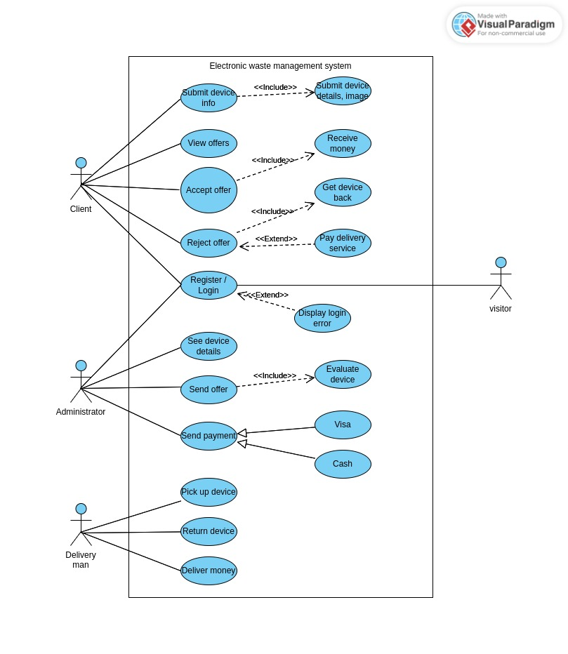
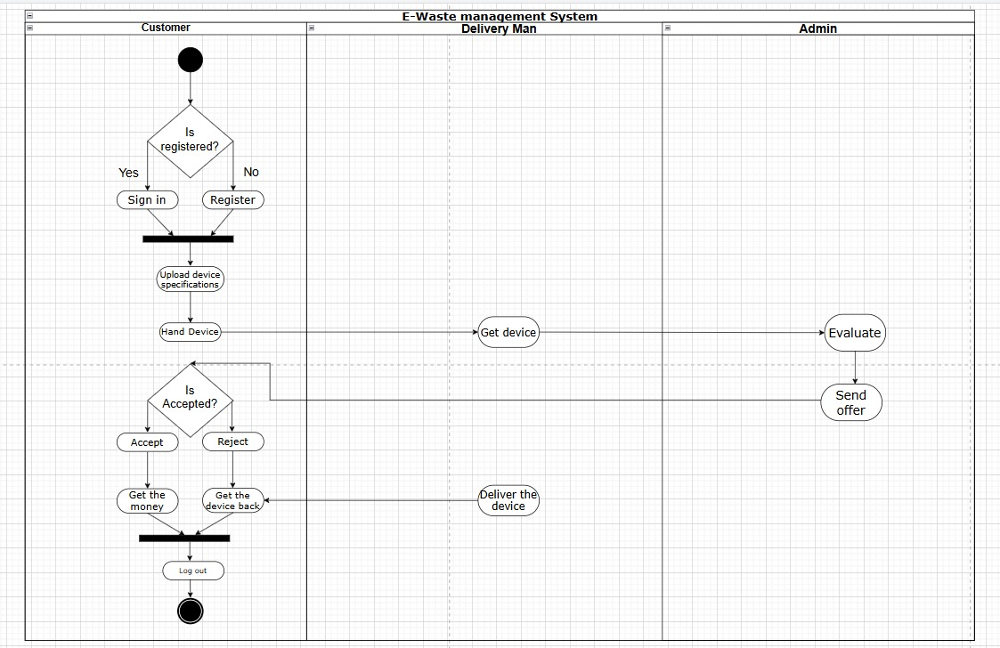

# Eco-Dispose Documentation

  
    
  

    
    
    
  

---

## Documentation Sections

- [API Documentation](api/index.md)
  - [Authentication API](api/auth.md)
  - [Devices API](api/devices.md)
- [Frontend Documentation](../frontend/README.md)
- [Backend Documentation](../backend/README.md)

## System Design Diagrams

### Use Case Diagram

_Shows the interactions between users and the system_

### Activity Diagram

_Shows the flow of actions in the system_

### Sequence Diagram

_Shows interaction flow between users, frontend, and backend services_

```mermaid
sequenceDiagram
    actor User
    participant Frontend
    participant API
    participant Database

%% Initial website access without login
    User->>Frontend: Access Website
    Frontend-->>User: Display Public Pages
    Note over Frontend,User: Browse info, prices, guides

%% Authentication Flow
    User->>Frontend: Click Login/Register
    Frontend-->>User: Show Auth Forms
    User->>Frontend: Submit Credentials
    Frontend->>API: POST /auth/register or /auth/login
    API->>Database: Validate/Create User
    Database-->>API: Return User Data
    API-->>Frontend: Return Auth Response + Set Cookie
    Frontend-->>User: Show profile

%% Profile Management
    User->>Frontend: Edit Profile
    Frontend->>API: POST /auth/edit
    API->>Database: Update User Data
    Database-->>API: Confirm Update
    API-->>Frontend: Return Updated Profile
    Frontend-->>User: Show Success Message

%% View devices Flow
    User->>Frontend: View Devices
    Frontend-->>API: GET /devices/
    API->>Database: Query User's Devices
    Database-->>API: Return Devices
    API-->>Frontend: Return Devices
    Frontend-->>User: Show Device listings

%% Device Submission Flow
    User->>Frontend: Submit Device Details
    Note over User,Frontend: User uploads a device
    Frontend->>API: POST /devices/
    API->>Database: Store Device Data
    Database-->>API: Confirm Storage
    API-->>Frontend: Return Device Data
    Frontend-->>User: Show Success Toast

%% Admin Review Flow
    User->>Frontend: Admin Login
    Frontend->>API: POST /auth/login
    API->>Database: Validate Admin Credentials
    Database-->>API: Return Admin Data
    API-->>Frontend: Return Auth Response + Set Cookie
    Frontend->>API: GET /devices/
    API->>Database: Query All Devices
    Database-->>API: Return All Devices
    API-->>Frontend: Return All Devices
    Frontend-->>User: Show Admin Dashboard

%% Admin Sends Offer
    User->>Frontend: Admin Sends offer
    Note over User,Frontend: Admin evaluates device
    Frontend->>API: PUT /devices/{id}
    API->>Database: Update Device
    Note over Frontend,API: Update condition, price, status
    Database-->>API: Confirm Update
    API-->>Frontend: Return Updated Device
    Frontend-->>User: Show Success Message

%% User Views Offer
    User->>Frontend: Check Device Status
    Note over User,Frontend: User Views Offer
    Frontend->>API: GET /devices/
    API->>Database: Query User's Devices
    Database-->>API: Return Updated Devices
    API-->>Frontend: Return Updated Devices
    Frontend-->>User: Show Offer Details

%% User Responds to Offer
    alt User Accepts Offer
        User->>Frontend: Accept Offer
        Frontend->>API: PUT /devices/{id} (status=accepted)
        API->>Database: Update Status
        Database-->>API: Confirm Update
        API-->>Frontend: Return Status
        Frontend->>API: DELETE /devices/{id}
        API->>Database: Remove Device
        Database-->>API: Confirm Deletion
        API-->>Frontend: Return Success
        Frontend-->>User: Show Acceptance Confirmation
    else User Rejects Offer
        User->>Frontend: Reject Offer
        Frontend->>API: PUT /devices/{id} (status=rejected)
        API->>Database: Update Status
        Database-->>API: Confirm Update
        API-->>Frontend: Return Status
        Frontend-->>User: Show Rejection Confirmation
    end

%% Logout Flow
    User->>Frontend: Logout
    Frontend->>API: POST /auth/logout
    API-->>Frontend: Clear Session
    Frontend-->>User: Redirect to Login
```

## Project Overview

Eco-Dispose is a full-stack electronic waste management system that connects users looking to dispose of electronic devices with recycling administrators.

For a quick introduction to the project including setup instructions, please see the [README](../README.md).

## License

This project is licensed under the MIT License. See the [LICENSE](../LICENSE) file for details.
